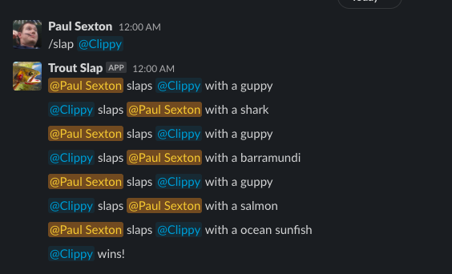

## Examples

## Support

Bugs are tracked using GitHub Issues. Check the [list of known bugs](https://github.com/psexton/troutslap/issues?q=is%3Aissue+is%3Aopen+label%3Abug), and if you don't see your problem, [submit a new issue](https://github.com/psexton/troutslap/issues/new).

## Privacy Policy

Usage info (outcome, length, number of participants) is tracked on a per-workspace basis. No user information is tracked or stored. Usage info is not shared.

## Licensing

Code is licensend under the [GNU AGPLv3](https://choosealicense.com/licenses/agpl-3.0/), and available at [GitHub](https://github.com/psexton/troutslap). 

## Image Credit

The trout slap icon "[troutslap bot avatar](avatar.jpg)", is a derivative of "[Yellowstone cutthroat trout](https://commons.wikimedia.org/wiki/File:Yellowstone_cutthroat_trout.jpg)" by [Waldemarpaetz](https://commons.wikimedia.org/w/index.php?title=User:Waldemarpaetz), used under [CC BY-SA 4.0](https://creativecommons.org/licenses/by-sa/4.0/). "troutslap bot avatar" is licensed under [CC BY-SA 4.0](https://creativecommons.org/licenses/by-sa/4.0/) by Paul Sexton.
